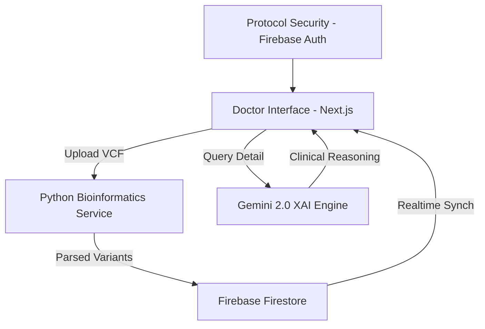

# 🧬 PharmaGuard: AI-Driven Pharmacogenomics Platform

 

PharmaGuard is a high-fidelity, enterprise-grade clinical diagnostic suite designed to bridge the gap between complex genomic data and actionable medical prescriptions. By integrating **Gemini 2.0 Flash** for explainable AI reasoning and a high-performance **Python Bioinformatics Backend**, PharmaGuard provides doctors with a "Clinical Silence" interface—minimizing noise and maximizing precision.

---

## 🚀 Key Features

- **Gemini-Powered XAI Reasoning**: Real-time biological interpretation of drug-gene interactions, explaining *why* a medication is risky based on allele pathways.
- **Bioinformatics Pipeline**: Automated VCF/FASTA ingestion and parsing via a specialized Python backend.
- **Clinical Command Center**: A centralized, notification-driven dashboard (Clinical Silence philosophy) that avoids intrusive pop-ups.
- **Prescription Guidance Strategy**: Automated logic for high-risk genes (DPYD, CYP2C19, etc.) with validated medication alternatives.
- **Dual-Protocol Theme Engine**: Switch between a high-contrast Neon Purple "Clinical Dark" and a vibrant Lilac "Clinical Light" mode.
- **Digital DNA Atmosphere**: Immersive UI with genetic code digital rain and 3D parallax medical visualizations.

---

## 🛠️ Tech Stack

### Frontend & UI
- **Framework**: Next.js 14 (App Router)
- **Styling**: Tailwind CSS (Custom Design System)
- **Animations**: Framer Motion (Scroll-parallax & specialized medical effects)
- **State Management**: React Context API
- **Fonts**: Inter & Orbitron (Cyber-Medical aesthetic)

### Backend & Intelligence
- **Bioinformatics Engine**: Python 3.10+ (FastAPI / Pandas / PyVCF)
- **AI Model**: Google Gemini 2.0 Flash
- **Database**: Firebase Firestore (Realtime Clinical Records)
- **Authentication**: Firebase Auth (Secure Protocol Access)
- **Storage**: Firebase Cloud Storage (Genomic Data Hosting)

---

## 🏗️ System Architecture

PharmaGuard operates on a hybrid distributed architecture to balance high-speed UI responsiveness with heavy computational genomics:



### 1. The Clinical Frontend (Next.js)
Handles the high-fidelity visualization, patient management, and AI interaction. It uses a custom-built **ThemeContext** to maintain visual protocol standards.

### 2. The Bioinformatics Backend (Python)
A high-performance Python microservice handles the heavy lifting:
- **Variant Parsing**: Processes raw genomic files (VCF) to isolate critical SNPs.
- **Allele Frequency Computation**: Cross-references internal medical databases to determine risk severity.
- **API**: Serves processed clinical payloads to the Next.js interface via FastAPI.

### 3. The AI Reasoning Core (Gemini)
Instead of simple if-else logic, PharmaGuard employs LLM-driven reasoning to provide a "Consultant Level" explanation of genomic risks, helping doctors understand the metabolic pathway interference.

---

## 📦 Installation & Setup

### Frontend Setup
1. Clone the repository:
   ```bash
   git clone https://github.com/anikettagor2/PHARMAGUARD.git
   ```
2. Install dependencies:
   ```bash
   npm install
   ```
3. Create a `.env.local` file with your Firebase and Gemini credentials:
   ```env
   NEXT_PUBLIC_FIREBASE_API_KEY=your_key
   GEMINI_API_KEY=your_key
   ```
4. Start the clinical server:
   ```bash
   npm run dev
   ```

### Python Backend Setup
1. Navigate to the backend directory:
   ```bash
   cd backend
   ```
2. Install bioinformatics dependencies:
   ```bash
   pip install -r requirements.txt
   ```
3. Run the analysis engine:
   ```bash
   python main.py
   ```

---

## 🛡️ Security & HIPAA Compliance
PharmaGuard is built with security as a priority:
- **Clinical Silence**: No transient alerts; all data is contained within the secure Notification Center.
- **Encrypted Storage**: Genomic data is encrypted at rest within Firebase.
- **Credential Masking**: All keys are managed via environment variables and never exposed to the client.

---

## 👨‍💻 Developed By
**PharmaGuard Team** - *Precision Medicine for the Future.*

[](https://github.com/anikettagor2)
